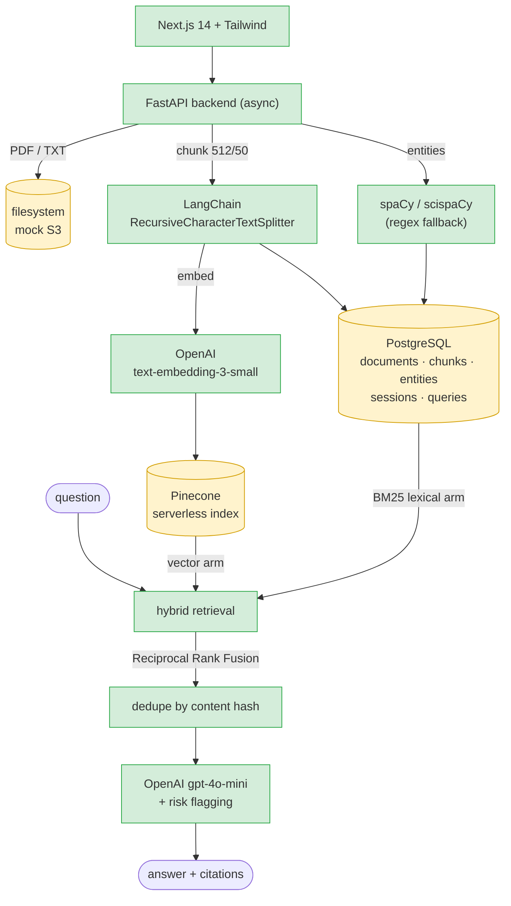

# MedQuery — Clinical Document Intelligence

**Clinical questions get answered from the wrong chunk when retrieval is
semantic-only — MedQuery fuses lexical and vector search so exact terms like
"HbA1c" land the chunk that actually contains the value, and measures that it
worked.**

A full-stack RAG system for clinical documents: upload discharge summaries, lab
reports, clinical notes and radiology reports; MedQuery extracts text, chunks it,
embeds it, mines medical entities, and answers grounded questions with source
citations, latency/confidence tracking, and a high-risk content banner.

---

## Architecture



The embedding provider, vector store, and chat LLM all have **drop-in fakes** that
activate automatically when no API key is configured (`USE_FAKE_PROVIDERS=true` by
default), so the full pipeline runs end-to-end offline and is covered by
integration tests.

---

## The key design decision: hybrid retrieval fused with RRF

**The alternative I rejected:** pure vector similarity — embed the question, take
the nearest chunks. It's the default RAG recipe and it handles paraphrasing well.

**Why it loses on clinical text:** clinical documents are dense with exact tokens
that carry the entire meaning — `HbA1c`, `creatinine`, `troponin`, dosages, ICD
codes. Embeddings compress those into a semantic neighbourhood where "HbA1c" sits
close to "blood glucose," "diabetes panel," and "A1C trend." Ask for a specific
value and a semantically-related chunk can outrank the one that literally
contains it. In a clinical setting a confidently-cited *near-miss* is worse than
no answer.

**The second alternative I rejected:** run both arms and blend the scores with a
weight. This breaks because cosine similarity and BM25 aren't on the same scale
or distribution — any fixed weight is a magic number tuned to one corpus, and it
silently stops being right when the corpus changes.

**What MedQuery does instead:** run both arms and fuse with **Reciprocal Rank
Fusion**, which consumes only the *rank* each arm assigns, never the raw score.
Nothing needs normalising, there is no weight to tune, and a chunk that ranks
well in either arm surfaces. To make the lexical arm possible, chunk text is
persisted to a `chunks` table keyed `{document_id}:{index}` — the same id used as
the vector id — so the two arms fuse on a shared key.

**What it costs, honestly:** a second retrieval path and a `chunks` table to keep
in sync with the vector store, plus BM25 as a pure-Python implementation that
will not scale to a large corpus (the next step there is Postgres `to_tsvector` /
`ts_rank`). Toggle with `USE_HYBRID_RETRIEVAL=false`.

---

## Measured result

A RAG system is only as good as its retrieval, so there's a harness that measures
it instead of relying on vibes (`backend/eval/`). It ingests a labeled fixture set
(`eval/fixtures.json` — synthetic clinical documents, each question tagged with
the gold chunk it should retrieve) and reports **recall@k** and **MRR@k** for all
three modes. Reproduced **2026-08-05**:

```bash
cd backend && python -m eval.run_eval
```

| Mode (k=5) | recall@k | MRR@k |
|---|---|---|
| vector only | 0.750 | 0.408 |
| lexical only | 0.833 | 0.625 |
| **hybrid (RRF)** | **0.917** | **0.694** |

Hybrid beats the better single arm by **+8.4 pts recall** and **+6.9 pts MRR**.

**One honest caveat:** the default fake embedding provider is hash-based, not
semantic, so the **vector** row is effectively a random baseline. This table shows
the lexical arm recovering exact terms and fusion improving on both — it is *not*
evidence that hybrid beats a real semantic embedder. For that, set
`OPENAI_API_KEY` and `USE_FAKE_PROVIDERS=false`; the harness uses whatever
provider is configured. `test_retrieval.py` asserts hybrid recall never drops
below vector-only, so CI guards the regression.

---

## Run it in under 2 minutes

```bash
cd backend
python3 -m venv .venv && source .venv/bin/activate
pip install -r requirements.txt
cp .env.example .env          # USE_FAKE_PROVIDERS=true by default
uvicorn app.main:app --reload
```

No Postgres, Pinecone, or API key needed — the fakes make the whole pipeline run
offline. API docs at **http://localhost:8000/docs**. For the UI:

```bash
cd frontend && cp .env.example .env.local && npm install && npm run dev
```

Or the whole thing at once: `cp .env.example .env && docker compose up --build`
(frontend :3000, backend :8000, Postgres :5432).

To use real providers, set `USE_FAKE_PROVIDERS=false` with `OPENAI_API_KEY` and
`PINECONE_API_KEY`. For real scispaCy entity extraction:

```bash
pip install spacy==3.7.5
pip install https://s3-us-west-2.amazonaws.com/ai2-s2-scispacy/releases/v0.5.4/en_core_sci_sm-0.5.4.tar.gz
```

---

## Repository layout

```
backend/   FastAPI service, SQLAlchemy models, services + tests
frontend/  Next.js 14 (App Router) + Tailwind dark clinical UI
docker-compose.yml   postgresql + fastapi-backend + nextjs-frontend
.env.example         Shared env keys consumed by docker-compose
```

## Backend

### Endpoints

| Method | Path                            | Description                                                                                          |
| ------ | ------------------------------- | ---------------------------------------------------------------------------------------------------- |
| POST   | `/upload`                       | Accepts PDF/TXT (max 10 MB), stores in mock-S3 dir, extracts text + chunks via LangChain (512/50)    |
| POST   | `/embed`                        | Embeds chunks via `text-embedding-3-small`, batched Pinecone upserts (≤100), free-tier cap warning   |
| POST   | `/extract`                      | spaCy `en_core_sci_sm` (or regex fallback) → medications, diagnoses, procedures, lab values          |
| POST   | `/query`                        | Hybrid retrieval (vector + BM25, RRF-fused), deduped by content hash, last 3 turns as context, returns answer + citations + risk |
| GET    | `/documents`                    | List uploaded documents with metadata                                                                |
| GET    | `/documents/{id}`               | Document metadata                                                                                    |
| GET    | `/documents/{id}/entities`      | All extracted entities for a document                                                                |
| DELETE | `/documents/{id}`               | Removes the document, its vectors, and entities                                                      |
| GET    | `/queries`                      | Recent queries (filterable by `session_id`)                                                          |
| GET    | `/analytics`                    | `total_queries`, `avg_latency_ms`, `avg_confidence`, `queries_per_document`, `top_questions`         |
| POST   | `/sessions`                     | Create chat session                                                                                  |
| GET    | `/sessions`                     | List sessions                                                                                        |
| GET    | `/sessions/{id}`                | Fetch a session with its messages                                                                    |
| DELETE | `/sessions/{id}`                | Delete session and cascade its queries                                                               |
| GET    | `/health`                       | Liveness probe                                                                                       |

All endpoints are `async`. CORS allows `http://localhost:3000` by default.

### Database schema (PostgreSQL via SQLAlchemy 2.0 async)

- `documents` — id, filename, document_type, upload_timestamp, chunk_count, pinecone_ids, storage_path, size_bytes, status
- `sessions` — id, created_at, document_ids
- `queries` — id, session_id, question, answer, retrieved_chunks, latency_ms, confidence, timestamp
- `entities` — id, document_id (FK), entity_type, entity_text, confidence, created_at
- `chunks` — id (`{document_id}:{index}`), document_id (FK), chunk_index, page, text

Models work against both Postgres (production) and SQLite (tests).

### Hardening (the known-issue checklist)

1. **Pinecone free-tier cap (100k vectors)** — `/embed` reads the index
   vector count first; soft-warns at 90 % and refuses with HTTP 507 if
   the upsert would exceed the limit. The warning surfaces in the
   dashboard + upload UI.
2. **Scanned-PDF detection** — `extract_text` raises
   `ScannedPdfError` (→ HTTP 422) if the combined extracted text from a
   PDF is shorter than 100 characters.
3. **OpenAI rate limits** — every embedding and chat call is wrapped in
   an async exponential-backoff retry (3 attempts: 2 s / 4 s / 8 s).
4. **Duplicate retrieved context** — `dedupe_matches` SHA-256 hashes the
   normalised chunk text and drops any repeats from LangChain's
   overlapping windows before the LLM sees them.
5. **Pinecone upsert batch limit (100)** — vectors are chunked into
   100-vector batches both for upsert and delete operations.
6. **CORS** — FastAPI `CORSMiddleware` configured for
   `http://localhost:3000` (configurable via `CORS_ORIGINS`).

### Retrieval design — the mechanics

The rationale is [above](#the-key-design-decision-hybrid-retrieval-fused-with-rrf);
the three stages are:

1. **Vector arm** — embed the question, pull the nearest chunks from the vector
   store (Pinecone, or the in-memory cosine store in fake mode).
2. **Lexical arm** — a BM25 search over the chunk text persisted in Postgres
   (`app/services/lexical.py`). This is what catches the exact-term cases.
3. **Fusion** — the two rankings are combined with Reciprocal Rank Fusion
   (`app/services/fusion.py`), which consumes ranks rather than scores.


The numbers and methodology are in [Measured result](#measured-result) above.
The harness lives in `backend/eval/` and writes `eval/results.json`.

What I'd improve next: a calibrated or groundedness-based confidence score (the
current one is the average cosine of the cited chunks), and an optional
cross-encoder reranker on top of the fused candidates.

### Stack

FastAPI · SQLAlchemy 2.0 (async) · PostgreSQL · asyncpg · LangChain ·
Pinecone · PyPDF2 · OpenAI · spaCy / scispaCy (optional) ·
pydantic-settings · python-dotenv · pytest-asyncio.

### Tests & CI

```bash
cd backend
pip install -r requirements-dev.txt
ruff check app eval tests
pytest
```

The suite in `backend/tests/` covers upload → embed → extract → query →
delete, scanned-PDF rejection, multi-turn sessions, session delete
cascading, analytics aggregation, deterministic embeddings, retry
helper, risk-flag detection, dedupe, entity extraction, and the new
retrieval pieces (BM25, RRF fusion, and the eval harness). It runs on
in-memory SQLite with the fake providers, so no Postgres, Pinecone, or
API key is needed.

GitHub Actions (`.github/workflows/ci.yml`) runs ruff + pytest on Python
3.11 and 3.12 for every push and pull request.

## Frontend

Built with Next.js 14 (App Router), Tailwind CSS, and a dark clinical
theme (slate/blue palette, JetBrains Mono accents).

Pages:

- `/` — Dashboard with document overview, **analytics panel**
  (totals, avg latency, avg confidence, per-document usage, top-5
  questions), recent queries.
- `/upload` — Drag-and-drop ingest, document type selector, live
  progress and embedding indicator (auto-triggers entity extraction).
- `/documents/[id]` — Document detail with stats and the **entity
  summary panel** (medications, diagnoses, procedures, lab values).
- `/query` — Multi-select document filter, chat history with collapsible
  source citations, latency + confidence badges, **prominent
  warning banner when `risk_flag: true`**, and a session sidebar to
  create / load / delete sessions (multi-turn aware).

Components: `TopNav`, `DocumentCard`, `ChatMessage`, `UploadZone`,
`SourceCitation`, `EntitySummaryPanel`, `AnalyticsPanel`.

### Running locally

```bash
cd frontend
cp .env.example .env.local
npm install
npm run dev          # http://localhost:3000
```

`NEXT_PUBLIC_API_URL` defaults to `http://localhost:8000`.

## Docker

The included `docker-compose.yml` defines three services on the
required ports:

| Service            | Port |
| ------------------ | ---- |
| `nextjs-frontend`  | 3000 |
| `fastapi-backend`  | 8000 |
| `postgresql`       | 5432 |

```bash
cp .env.example .env
docker compose up --build
```

## Notes on safety

MedQuery is grounded — answers are constructed only from retrieved
chunks, with citations rendered in the UI. The risk-flag service scans
the question, generated answer, and retrieved evidence for a fixed
list of high-risk clinical terms — `critical`, `STAT`, `emergency`,
`sepsis`, `deteriorating`, `DNR`, `code blue` — and the UI raises a
prominent warning banner whenever any are matched. The system
explicitly does **not** provide medical advice.
 
